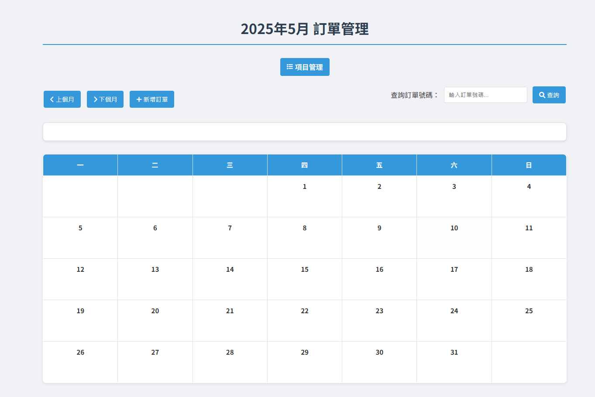
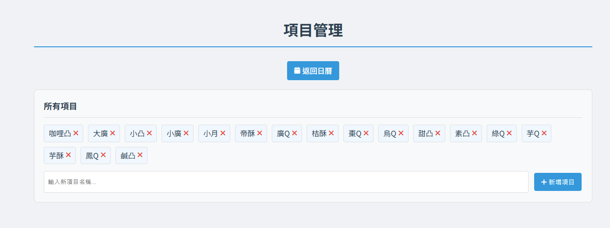
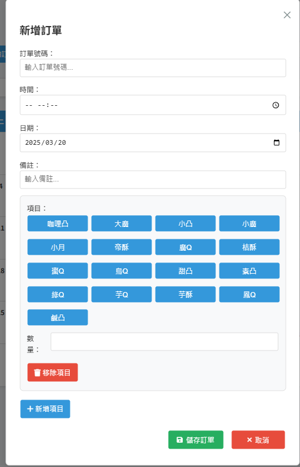
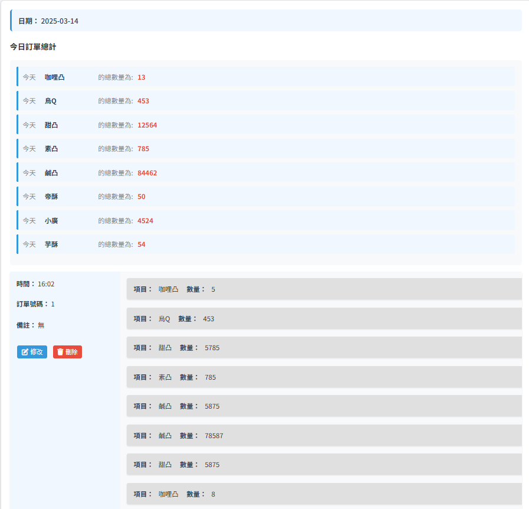

# 訂單管理系統

這是一個訂單管理設計的網頁應用程式，幫助店家有效管理和追蹤節日期間的訂單。





## 功能特色

- **日曆視圖**：直觀的月曆界面，顯示每日訂單數量
- **訂單管理**：新增、查詢、編輯和刪除訂單
- **項目管理**：自訂商品品項
- **時間排程**：設定訂單的取貨日期和時間
- **備註功能**：記錄客戶特殊需求或其他重要資訊

## 技術架構

- **後端**：Python Flask 框架
- **資料庫**：SQLite
- **前端**：HTML、CSS、JavaScript
- **部署**：使用 Waitress WSGI 伺服器

## 安裝與執行

### 必要條件
- Python 3.6 或更高版本
- 以下 Python 套件：Flask、Waitress

### 安裝步驟

1. git clone

2. 安裝必要的套件：
   ```
   pip install flask waitress
   ```

3. 啟動應用程式：
   ```
   python app.py
   ```

## 使用說明

### 訂單管理
1. 點擊「新增訂單」按鈕，填寫訂單資訊
2. 在日曆中點擊日期查看當日所有訂單
3. 使用訂單號碼查詢特定訂單
4. 點擊訂單可編輯或刪除

### 項目管理
1. 點擊「項目管理」連結進入管理頁面
2. 輸入新項目名稱並點擊「新增項目」
3. 點擊現有項目旁的 X 圖示可刪除項目

## 預設項目

系統預設提供以下月餅品項：
- 烏Q、綠Q、鳳Q、芋Q、棗Q、廣Q
- 甜凸、鹹凸、咖哩凸、素凸、小凸
- 帝酥、芋酥、桔酥
- a2小月、a6小廣、a8大廣
